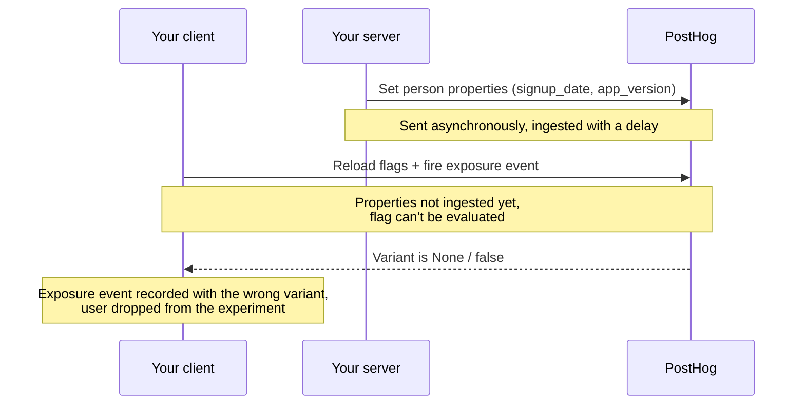

export const AssignAnOverrideLight = "https://res.cloudinary.com/dmukukwp6/video/upload/posthog.com/contents/images/features/experiments/assigning-an-override-light-mode.mp4"
export const AssignAnOverrideDark = "https://res.cloudinary.com/dmukukwp6/video/upload/posthog.com/contents/images/features/experiments/assigning-an-override-dark-mode.mp4"

import { ProductScreenshot } from 'components/ProductScreenshot'
import ReturningUsersExposures from "./snippets/returning-users-exposures.mdx"
export const ReuseFeatureFlagLight = "https://res.cloudinary.com/dmukukwp6/image/upload/posthog.com/contents/images/features/experiments/reuse-feature-flag-for-experiment-light-mode.png"
export const ReuseFeatureFlagDark = "https://res.cloudinary.com/dmukukwp6/image/upload/posthog.com/contents/images/features/experiments/reuse-feature-flag-for-experiment-dark-mode.png"

This page covers troubleshooting for Experiments. For setup, see the [installation guides](/docs/experiments/installation).

## Have a question? Ask PostHog AI

<AskAIInput placeholder="Type your question and hit enter..." />

## How do I use an existing feature flag in an experiment?

We generally don't recommend this, since experiment feature flags need to be in a specific format (see below) or otherwise they won't work.

However, if you insist on doing this (for example, you don't want to make code change), you can do this for **feature flags with at least 2 variants** by doing the following:

1. Delete the existing [feature flag](https://app.posthog.com/feature_flags) you'd like to use in the experiment
2. Create a new experiment and give your feature flag the same key as the feature flag you deleted in step 1.
3. Name the first variant in your new feature flag 'control'.

<ProductScreenshot
    imageLight = {ReuseFeatureFlagLight}
    imageDark = {ReuseFeatureFlagDark}
    alt = "Reuse an existing feature flag for an experiment"
    classes = "rounded"
/>

> **Note:** Deleting a flag is equivalent to disabling it, so it is off for however long it takes you to create the draft experiment. The flag is enabled as soon as you create the experiment (not launched).

## How do I run a second experiment using the same feature flag as the first experiment?

End the first experiment, then create a new experiment and select the existing flag. You can also duplicate the experiment, which preserves your metric setup and lets you choose between reusing the same flag, selecting a different existing flag, or creating a new one.

## Why am I getting a feature flag validation error when creating an experiment?

Experiments require feature flags to meet specific requirements. You may see validation errors if your feature flag doesn't meet them:

- **"Feature flag must have at least 2 variants (control and at least one test variant)"**: Experiments need at least two variants: a `control` and at least one test variant. Single-variant flags cannot be used for experiments.

- **"Feature flag must have a variant with key 'control'"**: One of your variants must have the key `control`. This is used as the baseline for comparison.

## How can I run experiments with my custom feature flag setup?

See our docs on [how to run an experiment without using feature flags](/docs/experiments/running-experiments-without-feature-flags).

## How do I assign a specific person to the control/test variant in an experiment?

Once you create the experiment, go to the feature flag, scroll down to "Release Conditions". For each condition, there is an "Optional Override". This enables you to choose a release condition and force all people in this release condition to have the variant chosen in the optional override.

<ProductVideo
    videoLight = {AssignAnOverrideLight}
    videoDark = {AssignAnOverrideDark}
    alt = "How to assign an experiment override"
    classes = "rounded"
/>

import FAQFalseOrNoneEvents from "../feature-flags/snippets/faq-false-or-none-events.mdx"

<FAQFalseOrNoneEvents />

## Why are returning users not showing as exposed to my experiment?

<ReturningUsersExposures />

## Why are my A/B test event numbers lower than when I create an insight directly?

Experiment results only count events that include the experiment's feature flag data. Sometimes, when you capture experiment events, the flags are not loaded yet. This means users don't see the experiment, their events won't have the flag data, and they are not included in the results calculation.

By default, insights count all the events, whether they include flag data or not. This is why they show a higher number. To confirm this, break down an insight by your experiment's flag and check the number of events with the value `None`.

A situation where this happens is using pageviews as your goal metric. Because pageviews are captured as soon as PostHog loads, the flag data may not have loaded yet, especially for first time users where flags aren't cached. Thus, the pageview count in insights might be higher than in your experiment.

To fix this, you make sure flags are immediately available on a page load. There are two options to do this:

1. [Wait for feature flags to load](/docs/feature-flags/adding-feature-flag-code#ensuring-flags-are-loaded-before-usage) before showing the page (low engineering effort, but slows page down by ~200ms).
2. Use [client-side bootstrapping](/docs/feature-flags/bootstrapping) (high engineering effort, but keeps the page blazing fast).

## My exposure event has the wrong variant because the flag wasn't ready when it fired

This is the most damaging version of the problem above, and it often goes unnoticed because the experiment still produces results, they're just biased.

It happens when the variant on your exposure event is decided before the data needed to evaluate the flag is available. The exposure event then carries `false` or `None` instead of `control` or `test`, and PostHog only counts users whose exposure event has a valid variant. Those incorrectly evaluated users are silently dropped from the experiment. If the dropped users aren't random, and they usually aren't, your results are skewed, not just smaller.

This is about the variant value on the **exposure event** specifically. Metric events don't carry a variant and aren't affected, see [metric events don't need a variant property](/docs/experiments/exposures#metric-events-dont-need-a-variant-property).

A common version of this is a client that evaluates a flag whose release conditions depend on person properties your server sets. The client can fire its exposure event before those properties have been ingested, so the flag can't be evaluated yet and the variant comes back wrong:

Common ways this happens:

- **A client evaluates a flag that depends on server-set person properties.** If your flag's release conditions filter on properties your backend sets (for example `signup_date` or `app_version`), a client that evaluates before those properties are ingested can't determine the variant. With [local evaluation](/docs/feature-flags/local-evaluation), the flag is omitted and the exposure event shows `None` (see [`None` vs `false`](#my-feature-flag-called-events-dont-show-my-variant-names) above). This is most likely for **new users in onboarding**, exactly where many high-stakes experiments run.
- **A flag is evaluated long before the change is reached.** For example, a screen fetches data ahead of time on app launch, so the exposure fires before the relevant person properties are set.
- **A flag is evaluated in parallel with another gate.** For example, an app version or capability check, so the variant on the event can disagree with what was actually shown.

To detect it, break down an insight of your exposure event by `$feature/<flag-key>` (or break down `$feature_flag_called` by `$feature_flag_response`) and look for a `false`, `None`, or `(empty string)` cohort. A large or variant-imbalanced missing cohort is the signature, and it often shows up as [sample ratio mismatch](#diagnosing-sample-ratio-mismatch-srm).

To fix it, in rough order of preference:

1. **Fire the exposure event from the surface that knows the correct variant.** If a flag depends on server-set person properties, evaluate it and emit exposure server-side, where those properties are available synchronously.
2. **Stamp the correct variant onto the exposure event explicitly.** Have your server provide the resolved `$feature/<flag-key>` value and set it on your [custom exposure event](/docs/experiments/exposures#custom-exposure-events), rather than relying on a separate client evaluation.
3. **Make the flag's inputs available before it's evaluated.** [Wait for flags to load](/docs/feature-flags/adding-feature-flag-code#ensuring-flags-are-loaded-before-usage), [bootstrap](/docs/feature-flags/bootstrapping) the client with known values, or set the properties the flag depends on locally.
4. **Avoid release conditions that depend on data unavailable at evaluation time.** If a flag enrolls new users only, make sure the property encoding "new user" is reliably present wherever the flag is evaluated.

## Why am I seeing unexpected results in my A/A test?

If you're [running an A/A test](/tutorials/aa-testing) (where both variants are identical) and seeing significant differences between variants, there are a few things to check:

1. **Feature flag calls**: Create a trend insight of unique users for `$feature_flag_called` events and verify they are equally split between variants. An uneven split suggests issues with flag evaluation.

2. **Implementation verification**:
   - Use feature flag overrides (like `posthog.featureFlags.overrideFeatureFlags({ flags: {'flag-key': 'test'}})`) to test each variant
   - Check the code runs identically across different states (logged in/out), browsers, and parameters
   - Verify that user properties and group assignments are set correctly before flag evaluation

3. **Session replays**: Watch session recordings filtered by your feature flag to spot any unexpected differences between variants.

4. **Random variation**: While A/A tests should theoretically show no difference, random chance can sometimes cause temporary statistical significance, especially with smaller sample sizes.

Remember: A successful A/A test validates your experimentation setup, while an "unsuccessful" one helps identify issues you can fix to improve your process. If you're still seeing unexplained significant differences, [contact support](https://app.posthog.com/home#supportModal=bug%3Aexperiments) for help troubleshooting.

## Why do I need a minimum number of exposures to run an experiment?

Experiments require a minimum of 50 exposures per variant before showing experiment results. This is necessary because, with too few exposures, the results may not be statistically significant and could lead to incorrect conclusions. This threshold ensures that the experiment data is reliable enough to make a decision.

You can check your current exposure count on the experiment results page. If your experiment is not reaching the minimum number of exposures, you can try the following:

- Verify your feature flag implementation.
- Consider increasing your feature flag's rollout percentage.
- Ensure your exposure events are firing correctly.

## Diagnosing sample ratio mismatch (SRM)

When PostHog flags SRM on your experiment, check these causes in order. They're ranked by frequency:

1. **Bot traffic.** Bots that trigger server-side flag evaluations are full experiment participants. They hash deterministically into one variant, skewing the split. Fix: enable the CDP Bot Filter Transformation in Settings → Data pipeline → Transformations.

2. **Flag condition changes.** Did someone modify the flag's release conditions or rollout percentage after launch? Check the flag's activity log. Even API-level changes count. The UI locks experiment-linked flags, but the API doesn't enforce the same restrictions.

3. **Identity fragmentation.** The same real user with two unlinked distinct IDs appears as two participants, potentially in different variants. Check your `identify()` flow. See [identity resolution](/docs/product-analytics/identity-resolution).

4. **SDK dedup cache overflow.** Server-side SDKs (Node, Python) dedup exposure events in-memory with a 50,000 entry cache. If your server handles more than 50k distinct flag+value combinations between restarts, earlier entries are evicted and those users may fire duplicate exposures.

5. **Normal early variance.** With fewer than ~1,000 exposures, a 55/45 split on a 50/50 experiment is statistically normal. Hash-based randomization converges with larger samples. If SRM fires early and your sample is small, wait.

## Common issues and self-diagnosis

### Users appearing in both control and test

This is an identity problem. The user has two distinct IDs that haven't been linked. PostHog sees two separate persons, each correctly assigned a variant.

**Check:** Are you calling `identify()` before or after the flag evaluation? Is the same stable ID used in every SDK that evaluates this flag? Did you call `reset()` somewhere that fragmented the session?

### Variant flipped mid-session

Something changed in the evaluation inputs. Common causes: `identify()` called after the flag was already evaluated with an anonymous ID. SDK cache cleared (by `reset()`, page reload without [bootstrapping](/docs/feature-flags/bootstrapping), or server restart). Release conditions modified on the flag while the experiment was running.

**Check:** Pull both `$feature_flag_called` events for the user and compare the `distinct_id`, timestamp, and person properties.

### Unexpected exposure numbers

The flag is being evaluated in a context you didn't expect. Server-side evaluation without bot filtering means bots are participants. `getAllFlags()` in your code means exposures aren't being recorded. Multiple SDKs evaluating the same flag with different distinct IDs means duplicate exposures.

**Check:** Search your codebase for every place the flag key appears. Is every evaluation using `getFeatureFlag()` or the server-side `evaluateFlags` API? Is the distinct ID consistent? Is bot traffic filtered? See [which SDK methods trigger exposure](/docs/experiments/exposures#which-sdk-methods-trigger-exposure).

### Metric shows all "none" values with a property breakdown

The property doesn't exist on the event you're measuring.

**Check:** Go to Data Management → Events → click the event → Properties tab. If your property isn't listed, your instrumentation needs to include it.

## Solved community questions

<SolvedQuestions
    topicLabel="Experiments"
/>